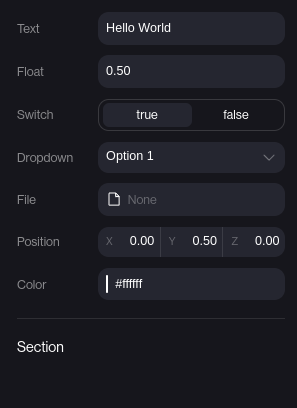

# `useFields()`

A React hook used to connect app variables to the editor UI.

## Fields

Each field is an object with properties that revolve around a `type`.

### Types:

- `text` - A text input field.
- `float` - A number input field.
- `switch` - A switch modal
- `dropdown` - A dropdown box.
- `file` - A file input field. Requires [useFile](use-file).
- `vec3` - A vector input field. `[x, y, z]`
- `color` - A color input field

### Properties

- `type` - The type of the field.
- `key` - The key of the field.
- `label` - The label of the field.
- `initial` - The initial value of the field.
- `placeholder` - The placeholder of the field.
- `options` - The options of the field (dropdown, switch, etc.)
- `accept` - The accepted file types of the field (file input).

### Special types:

- `section` - A section header. Only has a `label` property.

## Example

```jsx
import React from 'react'
//highlight-next-line
import { useFields, useFile } from "hyperfy";

export default function App() {
//highlight-start
  const fields = useFields();
  const { text, float, switchValue, dropdownValue, file, position, color } = fields;
//highlight-end
  const fileUrl = useFile(file);

  return (
    <app>
      <text value={`
        Text: ${text}
        Float: ${float}
        Switch: ${switchValue}
        Dropdown: ${dropdownValue}
      `} color={color}/>
      <image src={fileUrl ?? "https://hyperfy.io/logo-full.svg"} position={position} />
    </app>
  )
}

const initialState = {
  // ...
};

export const getStore = (state = initialState) => {
  return {
    state,
    actions: {},
//highlight-start
    fields: [
      {
        type: "text",
        key: "text",
        label: "Text",
        initial: "Hello World",
        // placeholder: "Enter text",
      },
      {
        type: "float",
        key: "float",
        label: "Float",
        initial: 0.5,
        // placeholder: "Enter float",
      },
      {
        type: "switch",
        key: "switchValue",
        label: "Switch",
        options: [
          {label: "true", value: true},
          {label: "false", value: false},
        ],
        initial: true,
      },
      {
        type: "dropdown",
        key: "dropdownValue",
        label: "Dropdown",
        options: [
          {label: "Option 1", value: "option1"},
          {label: "Option 2", value: "option2"},
        ],
        initial: "option1",
      },
      {
        type: "file",
        key: "file",
        label: "File",
        accept: ".png",
      },
      {
        type: "vec3",
        key: "position",
        label: "Position",
        initial: [0, 0.5, 0],
      },
      {
        type: "color",
        key: "color",
        label: "Color",
        initial: "white",
      },
      {
        type: "section",
        label: "Section",
      }
    ],
//highlight-end
  };
};
```

What this app looks like in the Hyperfy editor UI:

