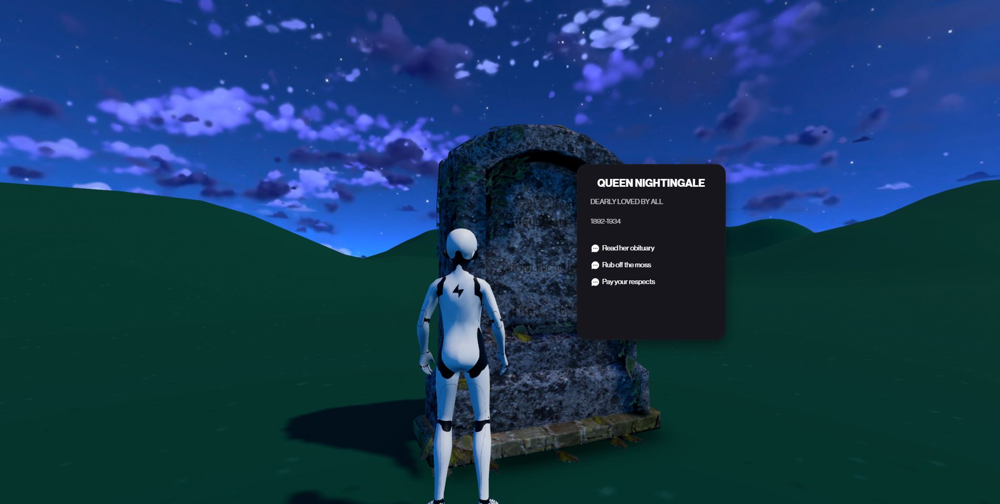
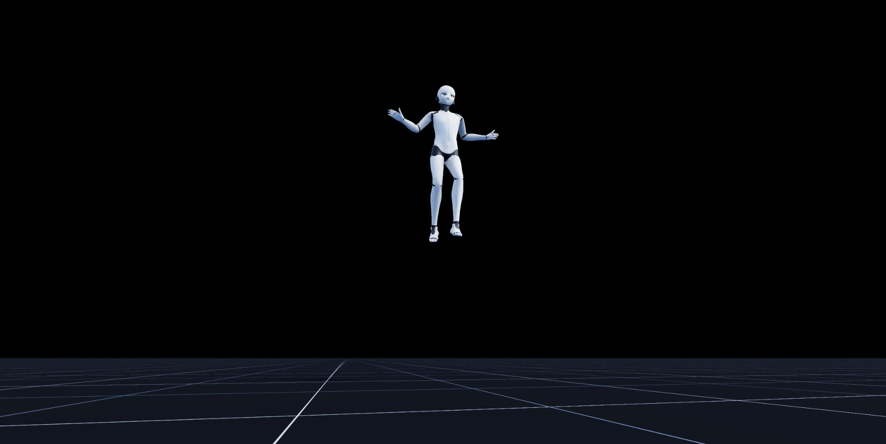
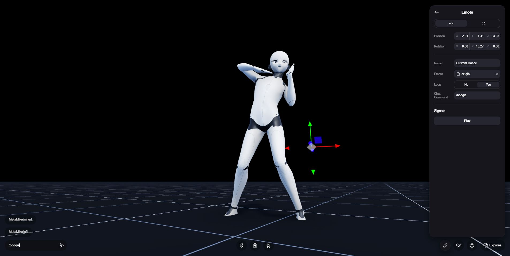
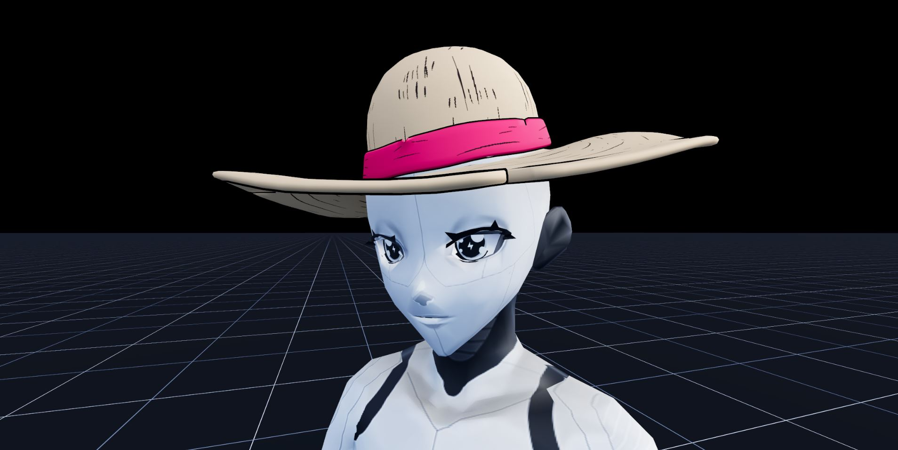
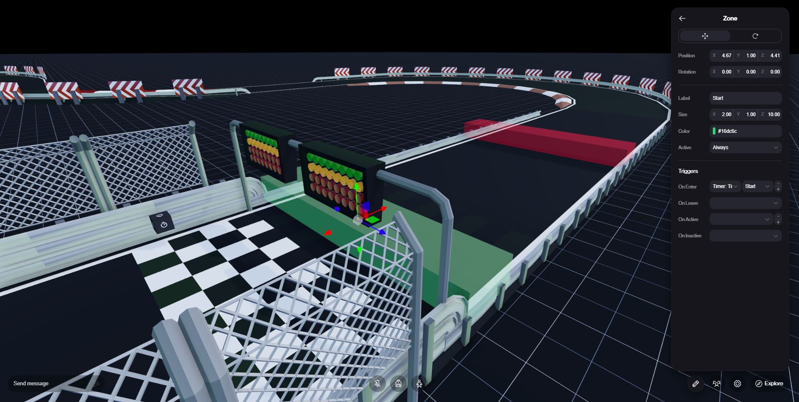
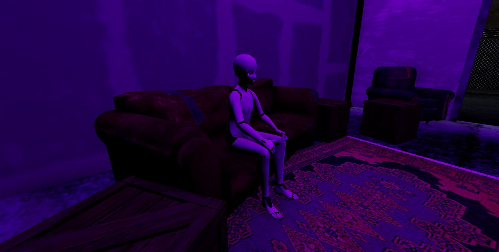
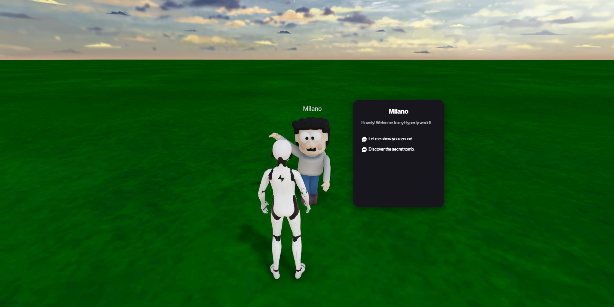
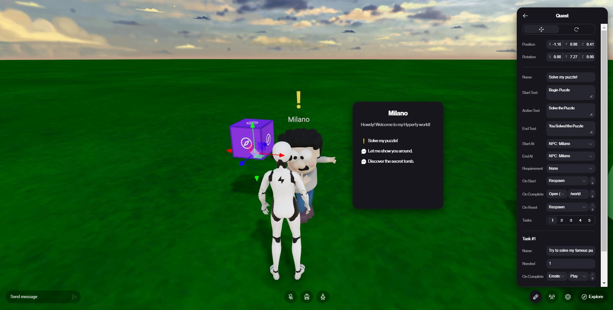

# Interaction

## POI

### Overview

The POI app allows you to create a point of interest in your world that can be used in conjunction with other apps to trigger, transport, or display different world elements.

### Configuration Parameters

#### General

- **Position**: The `X`, `Y`, `Z` values for the world position of the app.
- **Rotation**: The `X`, `Y`, `Z` values for the world rotation of the app.
- **Name**: Custom name for the POI.
- **Model**: Allows you to upload a `.glb` model for your POI.
- **Animation**: Select the animation/s from the `.glb` file to use with the model.
- **Greeting**: Allows you to set a greeting message for when a user interacts with the POI.
- **Icon Offset**: 🟠
- **Visible**: Allows you to set when the POI should be active.
- **Messages**: Allows you to create a set of custom prompts and responses for players to engage with in a structured format.

If you enable any message > 0:

- **Prompt**: Allows you to set a prompt for the user to engage with.
- **Response**: Allows you to set a message that the player sees after they've engaged with your prompt.
- **On Click**: The action that occurs when a player clicks on the prompt.
- **Visible**: Allows you to set when the message should be active.

## Shifter

### Overview

The Shifter app allows you to place a custom model in world which dynamically moves between two locations based on rules.

### Configuration Parameters

#### General

- **Position**: The `X`, `Y`, `Z` values for the world position of the app.
- **Rotation**: The `X`, `Y`, `Z` values for the world rotation of the app.
- **Label**: Custom name for the model.
- **Model**: Allows you to upload a `.glb` model for your model.
- **Collision**: Collision type used for mode (`Auto` applies collision automatically based on the uploaded model, `Convex` applies convex collision suitable for simple or convex shapes, `Trimesh` applies trimesh collision allowing for complex shapes but at a potential cost to performance).
- **Controlled**: `Yes` if the shifting should be controlled by an external action (e.g. completing a quest), `No` if shifting should be independent of an external action.

If you selected `No` for `Controlled`:

- **Type**: `Ping Pong` to move the model back and forth between its start and end point, `Loop` to loop the movement between its start and end point.

If you selected `Yo` for `Controlled`:

- **Sync**: 🟠

#### Timing

- **Duration**: The time it takes for the model to move between its start and end point.
- **Easing**: `Linear` applies linear acceleration between the start and end point, `Quad Out` applies quadratic acceleration easing to the end point, `Quad In Out` applies quadratic acceleration easing to the start and end point.

## Flying

### Overview

The Flying app allows you to enable flying in-world for players when they double-tap `Spacebar`.

### Configuration Parameters

#### General

- **Position**: The `X`, `Y`, `Z` values for the world position of the app.
- **Rotation**: The `X`, `Y`, `Z` values for the world rotation of the app.
- **Enabled**: Allows you to select when Flying is enabled.

## Free Look

### Overview

The Free Look app allows you to enable a free look camera in-world for players when they press `P`.

### Configuration Parameters

#### General

- **Position**: The `X`, `Y`, `Z` values for the world position of the app.
- **Rotation**: The `X`, `Y`, `Z` values for the world rotation of the app.
- **Enabled**: Allows you to select when Flying is enabled.

## Emote

### Overview

The Emote app allows you to create custom emotes for players to use when they enter a command into the world chat.

### Configuration Parameters

#### General

- **Position**: The `X`, `Y`, `Z` values for the world position of the app.
- **Rotation**: The `X`, `Y`, `Z` values for the world rotation of the app.
- **Name**: Custom name for the emote.
- **Emote**: Allows you to upload a `.glb` animation for your emote.
- **Loop**: `Yes` to loop the emote animation, `No` to play it once.
- **Chat Command**: Allows you to set a custom command to trigger the animation within the world chat. Players must append `/` to the command when using it in-world to trigger the animation.

## Attachable

### Overview

The Attachable app allows multiple players to attach a custom model to a particular bone of their avatar.

### Configuration Parameters

#### General

- **Position**: The `X`, `Y`, `Z` values for the world position of the app.
- **Rotation**: The `X`, `Y`, `Z` values for the world rotation of the app.
- **Model**: Allows you to upload a `.glb` model for your attachable.
- **Animation**: Select the animation/s from the `.glb` file to use with the model.
- **Attach To**: Allows you to select the bone to attach the model to.
- **Visibility**: `Everyone` to display the attachable to all players, `Local Only` to display the attachable to the local player.
- **Position**: The position of the attachable relative to the selected bone.
- **Rotation**: The rotation of the attachable relative to the selected bone.

## Scoreboard

### Overview

The Scoreboard app allows you to create a dynamic scoreboard for different timed in-world activities.

### Configuration Parameters

#### General

- **Position**: The `X`, `Y`, `Z` values for the world position of the app.
- **Rotation**: The `X`, `Y`, `Z` values for the world rotation of the app.
- **Label**: Custom name for the scoreboard.
- **Board ID**: Custom ID for the scoreboard.
- **Source**: Allows you to select the `Timer` app that populates the scoreboard.
- **Top**: `Highest` to sort scores in descending order, `Lowest` to sort scores in ascending order.
- **Color**: The color of the scoreboard text using hexadecimal value. This parameter has a color selector.
- **Scale**: The scale of the scoreboard.
- **Announce**: The message to display when a score gets posted to the scoreboard. `{name}` populates the announcement with the player's name, `{value}` populates the announcement with the player's score.

#### Board

- **Enabled**: `Yes` to display the scoreboard, `No` to hide the scoreboard.
- **Title**: The title displayed on the scoreboard.

## Timer

### Overview

The Timer app allows you to create a timer that get triggers by external apps.

### Configuration Parameters

#### General

- **Position**: The `X`, `Y`, `Z` values for the world position of the app.
- **Rotation**: The `X`, `Y`, `Z` values for the world rotation of the app.
- **Label**: Custom name for the timer.
- **Overlay**: `Yes` to display the timer's time on a player's local screen, `No` to hide the time.
- **Format**: The message to display on the timer. `{time}` populates the overlay with the current time.

## Zone

### Overview

The Zone app allows you to trigger different actions across apps when users interact with the zone space.

### Configuration Parameters

#### General

- **Position**: The `X`, `Y`, `Z` values for the world position of the app.
- **Rotation**: The `X`, `Y`, `Z` values for the world rotation of the app.
- **Label**: Custom name for the zone.
- **Size**: Sets the dimensions for the zone.
- **Color**: The color of the zone using hexadecimal value. This parameter has a color selector. This is only displayed when editing the world and is not visible to players.

#### Triggers

- **On Enter**: The action to take when a player enters the zone.
- **On Leave**: The action to take when a player leaves the zone.
- **On Active**: The action to take while a player is in the zone.
- **On Inactive**: The action to take while a player is outside of the zone.

## Seat

### Overview

The Seat app allows you to trigger a sitting emote at a given location to emulate a player sitting.

### Configuration Parameters

#### General

- **Position**: The `X`, `Y`, `Z` values for the world position of the app.
- **Rotation**: The `X`, `Y`, `Z` values for the world rotation of the app.
- **Label**: Custom name for the seat.
- **Emote**: Allows you to upload a custom `.glb` animation for your sitting animation.
- **Clickable**: `Yes` to allow players to click to sit, `No` to hide this option.

If `Clickable` is set to `Yes`:

- **Hint**: Message to display on interaction.

## NPC

### Overview

The NPC app allows you to deploy a Non Playable Character in-world with customizable dialogue trees.

### Configuration Parameters

#### General

- **Position**: The `X`, `Y`, `Z` values for the world position of the app.
- **Rotation**: The `X`, `Y`, `Z` values for the world rotation of the app.
- **Name**: Custom name for the NPC.
- **Model**: Allows you to upload a custom `.vrm` avatar for your NPC.
- **Emote**: Allows you to upload a custom `.glb` animation for your NPC.
- **Greeting**: Allows you to set a greeting message for when a user interacts with the NPC.
- **Visible**: Allows you to set when the NPC greeting should be active.
- **Messages**: Allows you to create a set of custom prompts and responses for players to engage with in a structured format.

If you enable any message > 0:

- **Prompt**: Allows you to set a prompt for the user to engage with.
- **Response**: Allows you to set a message that the player sees after they've engaged with your prompt.
- **On Click**: The action that occurs when a player clicks on the prompt.
- **Visible**: Allows you to set when the message should be active.

## Receiver

### Overview

The Reciever app allows in-world actions to be triggered by tokens in players' wallets.

### Configuration Parameters

#### General

- **Position**: The `X`, `Y`, `Z` values for the world position of the app.
- **Rotation**: The `X`, `Y`, `Z` values for the world rotation of the app.
- **Contract**: The contract address for the token to be used with the receiver.
- **Token ID**: The token ID for the token to be used with the receiver. Leave as `Any` if you're wanting to use a collection with the receiver rather than an individual token.
- **Distance**: The distance in which the receiver app can be triggered.
- **Active**: Allows you to set when the receiver should be active.
- **On Use**: The action to be taken when the receiver is used.

## Randomizer

### Overview

The Randomizer enables randomization of multiple actions.

### Configuration Parameters

#### General

- **Position**: The `X`, `Y`, `Z` values for the world position of the app.
- **Rotation**: The `X`, `Y`, `Z` values for the world rotation of the app.
- **Label**: Custom name for the randomizer.
- **Active**: Allows you to set when the randomizer should be active.
- **Amount**: The number of actions to randomize between.

#### Action

- **Weight**: The randomization weight applied to this action. A weight of `1` represents an equal split of selection probablity between all actions.

## Quest

### Overview

The Quest app allows the creation of dynamic in-world quests.

### Configuration Parameters

#### General

- **Position**: The `X`, `Y`, `Z` values for the world position of the app.
- **Rotation**: The `X`, `Y`, `Z` values for the world rotation of the app.
- **Label**: Custom name for the quest.
- **Start Text**: Message displayed when the quest starts.
- **Active Text**: Message shown while the quest is in progress.
- **End Text**: Message displayed upon quest completion.
- **Start At**: POI that triggers the quest to start.
- **End At**: POI that triggers the quest's completion.
- **Requirement**: Optional requirement action needed to be taken to begin quest.
- **On Start**: Action to be taken when quest begins.
- **On Complete**: Action to be taken when quest finishes.
- **On Reset**: Action to be taken when quest is reset.
- **Tasks**: The number of tasks associated with the quest.

#### Task

- **Name**: Custom name for the task.
- **Needed**: The tasks needed to be completed to unlock this task.
- **On Complete**: Action to be taken when task is completed.

## Smart Object

### Overview

The Smart Object allows you to create dynamic objects that have multiple states and change based on in-world actions.

### Configuration Parameters

#### General

- **Position**: The `X`, `Y`, `Z` values for the world position of the app.
- **Rotation**: The `X`, `Y`, `Z` values for the world rotation of the app.
- **Label**: Custom name for the smart object.
- **Active**: Selector for when the smart object should be active.
- **Sync**: `Yes` to sync animations between smart objects, `No` to run asynchronously.
- **Stage**: Selector to choose which stage you want to adjust.

#### State

If `Stage` is set to 1:

- **Model**: Allows you to upload a `.glb` model for your smart object.
- **Collision**: `Yes` to inherit collision from the model, `No` to not apply collision.
- **Animation**: Selector for the animation you want to associate with the first stage. Also contains a `Loop` toggle which will loop the animation, and a `Blend` toggle that will blend multiple animations together.

If `Stage` is set to 2 or 3:

- **Model**: `Inherit` retains the model from the previous state, `Override` allows you to override the model from the previous state with another `.glb`.
- **Collision**: `Inherit` retains the collision state from the previous state, `Override` allows you to override the collision properties from the previous state.
- **Animation**: `Inherit` retains the animation/s from the previous state, `Override` allows you to override the animations from the previous state.

#### Interaction

- **Type**: Select whether your smart object is interactable on `Click`, `Proximity` or `None`.

If `Click` is selected:

- **Hint**: Message to display when player is interacting with smart object.

If `Proximity` is selected:

- **Radius**: The radius in which the smart object interaction is triggered.

I `Click` or `Proximity` are selected:

- **Allowed**: Selector to determine when interaction with smart object is allowed.
- **On Interact**: Action to take when smart object is interacted with.

## Reactor

### Overview

The Reactor app allows is a control flow app that allows you to trigger different actions based on specified conditions.

### Configuration Parameters

#### General

- **Position**: The `X`, `Y`, `Z` values for the world position of the app.
- **Rotation**: The `X`, `Y`, `Z` values for the world rotation of the app.
- **Label**: Custom name for the reactor.
- **Condition**: Condition to initiate reactor.
- **On Active**: Action to take when reactor is active.
- **On Inactive**: Action to take when reactor is inactive.
