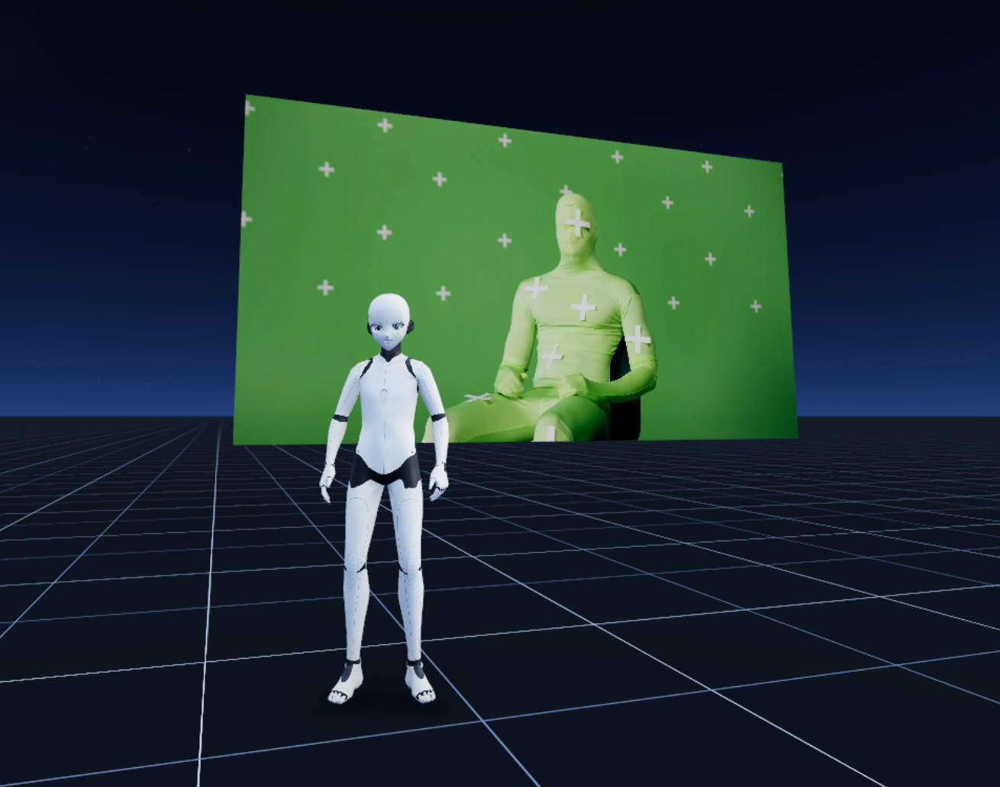
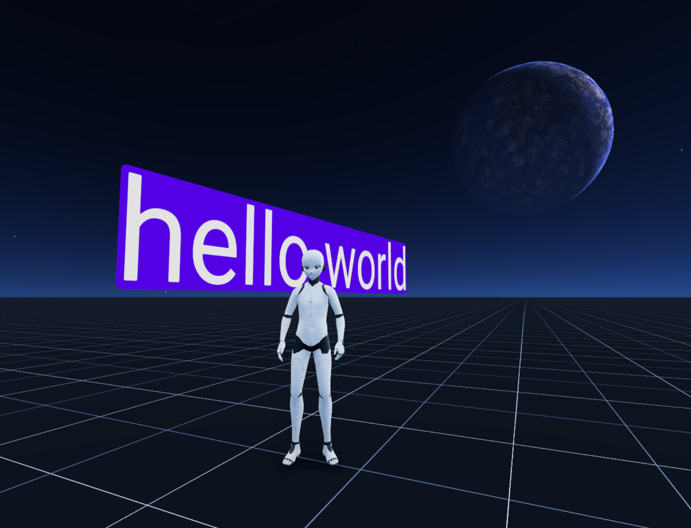
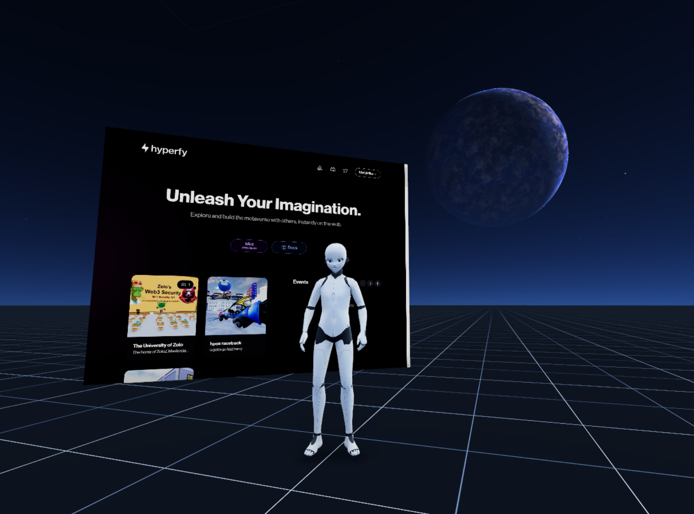
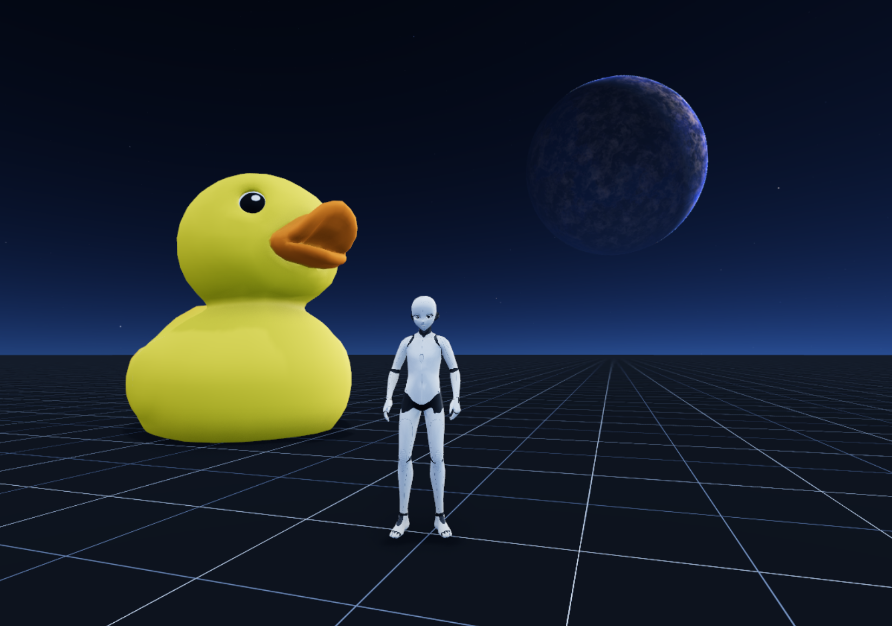
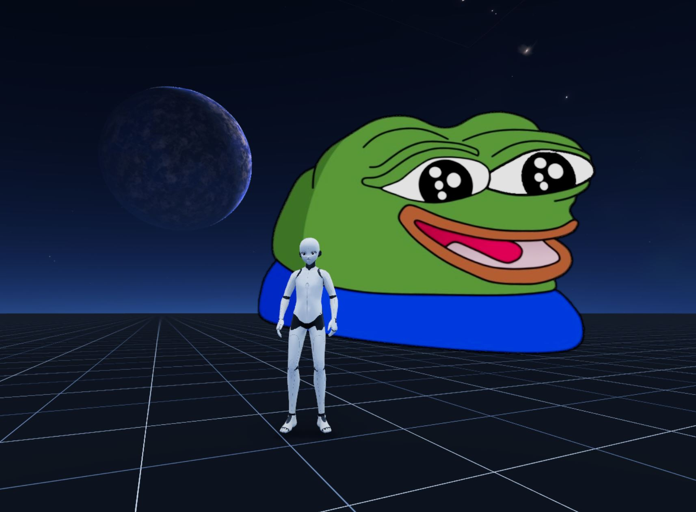
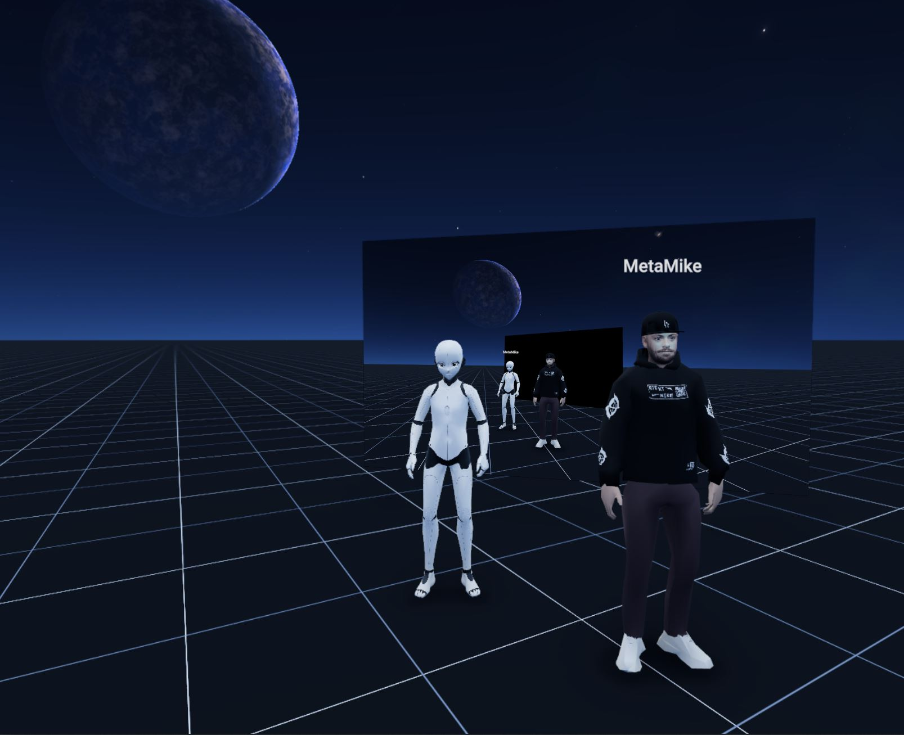

# Media

## Video

### Overview

The video app allows users to bring video content in world by uploading a video file or playing from a URL.

### Configuration Parameters

#### General

- **Position**: The `X`, `Y`, `Z` values for the world position of the app.
- **Rotation**: The `X`, `Y`, `Z` values for the world rotation of the app.
- **Label**: Custom label for video.
- **Type**: `File` for local .mp4 file, `URL` for .mp4 or .m3u8 link.
- **Loop**: `Yes` to loop the video, `No` to play it once.
- **Autoplay**: `Yes` to play the video automatically, `No` to require user action.
- **Active**: When the video should be active (`Always`, `Flag Set`, `Quest Active` etc.).

#### Display

Depending on the `Type` selected, the available options for `Display` will change:

##### When Type is set to `Plane`

- **Height**: The height of the video plane in the 3D world.
- **Lit**: `Yes` if the video plane should be affected by world lighting, `No` if not.
- **Frame**: `Yes` to display a frame around the video, `No` to have no frame.

##### When Type is set to `Model`

- **File**: Choose a `.glb` file to apply the video as a texture to a 3D model.
- **UVs**: `Cover` to scale the video to cover the model's UVs, `Inherit` to use the model's existing UV layout.

#### Audio

- **Volume**: The volume of the video's audio.
- **Spatial**: `Yes` for spatial audio that changes with the listener's position, `No` for non-spatial audio.
- **Distance**: The maximum distance at which the audio can be heard.
- **Rolloff**: The rate at which the audio volume decreases as the listener moves away from the source.

#### Interaction

- **On Click**: Action to take when a user clicks the video object.
- **Hint**: Message to display when a user interacts with video object.

## Stream

### Overview

The stream app allows users to bring livestreams into their world.

### Configuration Parameters

#### General

- **Position**: The `X`, `Y`, `Z` values for the world position of the app.
- **Rotation**: The `X`, `Y`, `Z` values for the world rotation of the app.
- **Offline**: `No` if you want the video plane hidden. `Yes` if you want the video plane rendered.
- **Stream URL**: URL of video stream. Must be a .m3u8 link.
- **Thumbnail**: Thumbnail to display when stream is deactivated.
- **Height**: Height of video plane.
- **Active**: When the video should be active (`Always`, `On Click`, `On Proximity`).

#### Audio

- **Volume**: The volume of the video's audio.
- **Distance**: The maximum distance at which the audio can be heard.
- **Rolloff**: The rate at which the audio volume decreases as the listener moves away from the source.
- **ID**: Allows you to associate an audio channel ID for use with other audio-reactive components.

#### Frame

- **Enabled**: `Yes` to display a frame around the video, `No` to have no frame.

## Audio

### Overview

The audio app allows users to bring audio files (both uploaded and online) to their worlds.

### Configuration Parameters

#### General

- **Position**: The `X`, `Y`, `Z` values for the world position of the app.
- **Rotation**: The `X`, `Y`, `Z` values for the world rotation of the app.
- **Label**: Custom label for audio source.
- **Type**: `File` for local .mp3 file, `URL` for .mp3 link.
- **Volume**: Master volume for the audio source
- **Loop**: `Yes` to loop the audio, `No` to play it once.
- **Autoplay**: `Yes` to play the audio automatically, `No` to require user action.

#### Spatial

- **Enabled**: `Yes` to enable spatial audio, `No` for stereo audio. Spatial audio adjusts audio volume dynamically based on user world position. Stereo audio plays the audio source at a constant volume set in the **Volume** parameter.
- **Volume**: The volume of the video's audio.
- **Distance**: The maximum distance at which the audio can be heard.
- **Rolloff**: The rate at which the audio volume decreases as the listener moves away from the source.

## Text

### Overview

The text app allows you to create a text canvas in your world

### Configuration Parameters

#### General

- **Position**: The `X`, `Y`, `Z` values for the world position of the app.
- **Rotation**: The `X`, `Y`, `Z` values for the world rotation of the app.
- **Text**: The text you want to display on the canvas.
- **Size**: Size of the font.
- **Color**: Text color using hexadecimal value. This parameter has a color selector.
- **Align**: Text alignment on canvas (`Left`, `Center`, `Right` etc.).
- **Line Height**: The distance between lines of text.

#### Layout

- **Anchor X**: The text anchor point for the X axis relative to the text object's world position.
- **Anchor Y**: The text anchor point for the Y axis relative to the text object's world position.
- **Max Width**: The maximum width of the text canvas.

#### Background

- **Color**: Canvas background color using hexadecimal value. This parameter has a color selector.
- **Padding**: The padding between the text and the edge of the canvas.
- **Radius**: The radius size of the canvas.

#### Interaction

- **On Click**: Action to take when a user clicks the text canvas.
- **Hint**: Message to display when a user interacts with text canvas.

## Screen

### Overview

The screen app allows world admins to cast their screen to their world.

### Configuration Parameters

#### General

- **Position**: The `X`, `Y`, `Z` values for the world position of the app.
- **Rotation**: The `X`, `Y`, `Z` values for the world rotation of the app.
- **Label**: Custom label for video.
- **Thumbnail**: Thumbnail to display when casting is deactivated.
- **Height**: Height of video plane.

#### Audio

- **Volume**: The volume of the video's audio.
- **Spatial**: `Yes` for spatial audio that changes with the listener's position, `No` for non-spatial audio.
- **Distance**: The maximum distance at which the audio can be heard.
- **Rolloff**: The rate at which the audio volume decreases as the listener moves away from the source.

#### Frame

- **Enabled**: `Yes` to display a frame around the video, `No` to have no frame.

## Model

### Overview

The model app allows world owners to bring in custom `.glb` models into their world.

### Configuration Parameters

#### General

- **Position**: The `X`, `Y`, `Z` values for the world position of the app.
- **Rotation**: The `X`, `Y`, `Z` values for the world rotation of the app.
- **Type**: `File` for local `.glb` file, `URL` for `.glb` link.
- **Scale**: World scale of the model.
- **Collision**: Collision type used for mode (`None` applies no collision, `Inherit` inherits colliders from the `.glb` file, `All` applies collision to the entire model).
- **Animation**: Select the animation/s from the `.glb` file to use with the model.

#### Interaction

- **On Click**: Action to take when a user clicks the text canvas.
- **Hint**: Message to display when a user interacts with text canvas.

## Image

### Overview

The image app allows world owners to bring in `.png`, `.jpg` and `.gif` images into their world.

### Configuration Parameters

#### General

- **Position**: The `X`, `Y`, `Z` values for the world position of the app.
- **Rotation**: The `X`, `Y`, `Z` values for the world rotation of the app.
- **Type**: `File` for local `.png`, `.jpg` and `.gif` file, `URL` for `.png`, `.jpg` and `.gif` link.
- **Width**: Width of the image. `Auto` keeps the width proportional to the height of the image.
- **Height**: Height of image.
- **Lit**: `Yes` for image to be affected by world lighting, `No` for image to be unaffected by world lighting.
- **Doubleside**: `Yes` for image to be mirrored on back side of canvas, `No` for image to only be displayed on front side of canvas.

#### Frame

- **Enabled**: `Yes` to display a frame around the video, `No` to have no frame.

#### Interaction

- **On Click**: Action to take when a user clicks the text canvas.
- **Hint**: Message to display when a user interacts with text canvas.

## WebView

### Overview

Allows world owners to display webpages that users can interact with in world.

### Configuration Parameters

#### General

- **Position**: The `X`, `Y`, `Z` values for the world position of the app.
- **Rotation**: The `X`, `Y`, `Z` values for the world rotation of the app.
- **URL**: URL to display on the WebView canvas.
- **Width**: Width of the WebView canvas.
- **Height**: Height of WebView canvas.
- **Zoom**: Level of zoom applied to the WebView canvas.
- **Visible**: When the WebView should be active (`Always`, `On Click`, `On Proximity`).
- **Billboard**: `Yes` for image to be WebView canvas to rotate based on a player's world position, `No` to remain static.

**Note**: The activity of a player's experience in the WebView app is not syncronized to other players in the world.
